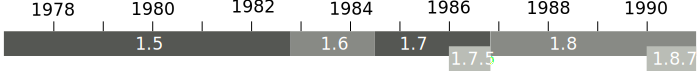

History
-------

In 1974 the research group *Programmiersprachen und Compiler II* at TU Berlin
led by C.H.A Koster and Hochschulrechenzentrum (HRZ) Bielefeld developed
different versions of *SLAN*, a programming language family suited for
educational purposes. This language was later renamed to *ELAN*.

Jochen Liedtke and Ulrich Bartling, both studying maths at Bielefeld University
at that time, created a compiler for SLAN3B as part of their diploma thesis in
1976 [liedtke76]_\ [bartling76]_. It was written in CDL, a machine independent
compiler description language, and generated code for Siemens’ BS 1000 and
BS 2000 mainframe operating system running on a BS 4004/45 machine. It was
later ported to the IBM 370 and TR 440 [hahn79]_.

But ELAN was supposed to be used in schools or at universities and most of them
could not affort the cost of such a machine. Thus a compiler and runtime system
for the smaller and less expensive microprocessors was needed [liedtke79]_.
Development of this system began in 1977 or 1978\ [#]_. It ran on the Zilog Z80
microprocessor with 64 kilobytes of RAM. This machine’s cost were approximately
20,000 DM (10,000 USD). The runtime system was called *Extendable multi user
microprocessor ELAN system*, abbreviated *EUMEL*.

A year later, in 1979, details about EUMEL were published in GMD Spiegel
[liedtke79]_, a quarterly publication published by GMD, and then presented at
*9. Jahrestagung der Gesellschaft für Informatik* at University of Bonn
[kloeckner79]_. Officially the cooperation between HRZ Bielefeld and GMD began
in fall 1979 [gmdspiegel85d]_.

.. [#] See [gmdspiegel85a]_, [liedtke93]_, [gmdbericht84]_, [ambros90b]_ and [praxis1]_

Releases
^^^^^^^^

The following table lists release dates. It was reconstructed from multiple
sources.

.. csv-table::
   :header: Version,Date,

    1.5, ≤1981
    1.6, ≤fall 1982, [alwr82]_
    1.7, ≤mid 1984, [korrekturen84]_
    1.7.5, end of 1985, [gmdbericht85]_
    1.8.0, October 1986
    1.8.7, ≤1990, [ambros90b]_

L3
^^

Ideas for EUMEL’s successor „version 2.0“ were first presented by Liedtke in
1985 [gmdspiegel85c]_.  Since fall 1986 EUMEL „native code“ was in development
[gmdbericht86a]_.  This would later become the *Level 3 Operating System (L3)*,
which was presented in 1988. It dropped the EUMEL0 virtual machine in favor of
native x86 code since Intel’s 386 processor provided all the features necessary
[gmdspiegel88a]_. In the same year, on 1988-06-30, a workshop with 63
attendants was held at GMD Birlinghofen  [gmdspiegel88c]_

Workshops
^^^^^^^^^

Between 1985 and 1988 a yearly workshop was held at different locations:

.. csv-table::
    :header: Date,Location,Attendance,

    1985-09-21,GMD Birlinghofen,300,[gmdspiegel85c]_
    1986-10-04,GMD Birlinghofen,350,[gmdbericht86b]_
    1987-09-19/21,GMD Sankt Augustin,200/100,[gmdspiegel87b]_
    1988-10-01,Realschule Niederpleis,200,[gmdspiegel88d]_

