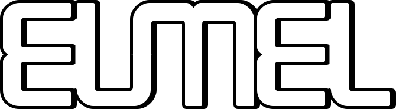

Trivia
------

   EUMEL’s logo

- The German word *Eumel* describes__ a likeable fool (wally).
- Wikipedia refers to EUMEL as *L2* (for *Liedtke 2*). However this name is
  not mentioned in any documentation or source code. It was added to the
  German__ and English__ Wikipedia in 2006 without a source, which could be
  `Jochen Liedtke’s death notice`__.
- EUMEL was a registered wordmark from 1985 to 1996 (DPMA: 1087527__ 1106662__)

__ https://dict.leo.org/forum/viewWrongentry.php?idThread=40527&idForum=6&lang=de&lp=ende
__ https://de.wikipedia.org/w/index.php?title=L2_(Betriebssystem)&diff=21818522&oldid=21818465
__ https://en.wikipedia.org/w/index.php?title=Eumel&diff=94747578&oldid=92908729
.. https://en.wikipedia.org/w/index.php?title=Eumel&diff=next&oldid=510781458
__ https://os.itec.kit.edu/downloads/in-memoriam-jochen-liedtke_de.pdf
__ https://register.dpma.de/DPMAregister/marke/register/1087527/DE
__ https://register.dpma.de/DPMAregister/marke/register/1106662/DE

